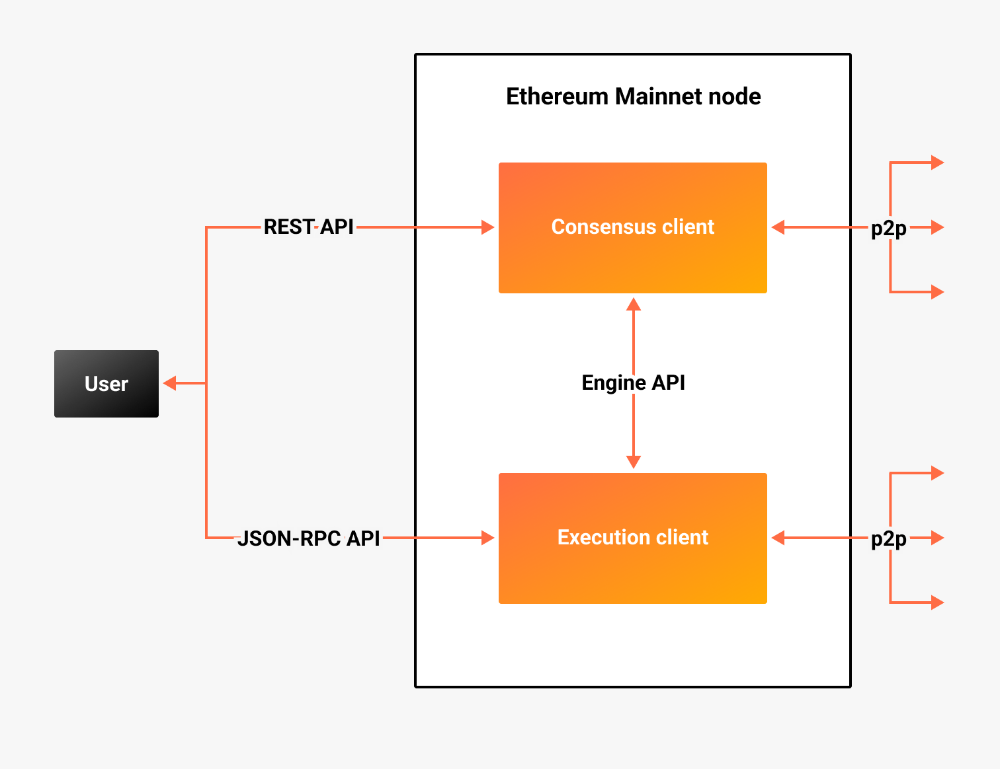

# The Merge

The Ethereum upgrade known as [The Merge](https://ethereum.org/en/upgrades/merge/) will merge the [Beacon Chain] into
Ethereum Mainnet, turning Mainnet into a combination of an
[execution layer and consensus layer](#execution-and-consensus-clients).
The Merge will transition Mainnet from proof of work to [proof of stake consensus](Proof-of-Stake.md).

## Execution and consensus clients

After The Merge, a full Ethereum Mainnet node will be a combination of an execution client (previously called an
[Ethereum 1.0](https://blog.ethereum.org/2022/01/24/the-great-eth2-renaming/) client) and a consensus client (previously
called an [Ethereum 2.0](https://blog.ethereum.org/2022/01/24/the-great-eth2-renaming/) client).

Execution clients, such as [Besu], manage the state and execute transactions on the execution layer.
Consensus clients, such as Teku, maintain [consensus](Proof-of-Stake.md) on the [Beacon Chain] (consensus layer).

Execution and consensus clients communicate with each other using the
[Engine API](https://github.com/ethereum/execution-apis/blob/main/src/engine/specification.md).
Execution clients serve [JSON-RPC API](https://besu.hyperledger.org/en/stable/Reference/API-Methods/) requests and
consensus clients serve [REST API](../Reference/Rest_API/Rest.md) requests.
Execution clients communicate among each other in a peer-to-peer network, and consensus clients do the same.

### Run a node

After The Merge, a Mainnet node operator must run both an execution client and a consensus client at the same time.
You must run a node to become a Mainnet [validator](Proof-of-Stake.md), but you can also run a non-validator node (run
the consensus client as a beacon node only).

You can [test Teku with Besu on the Kiln Merge testnet](https://besu.hyperledger.org/en/stable/Tutorials/Merge-Testnet/).

You can [run Teku on Ethereum Mainnet](../HowTo/Get-Started/Connect/Connect-To-Mainnet.md).

<!-- links -->
[Beacon Chain]: https://ethereum.org/en/upgrades/beacon-chain/
[Besu]: https://besu.hyperledger.org/en/stable/
