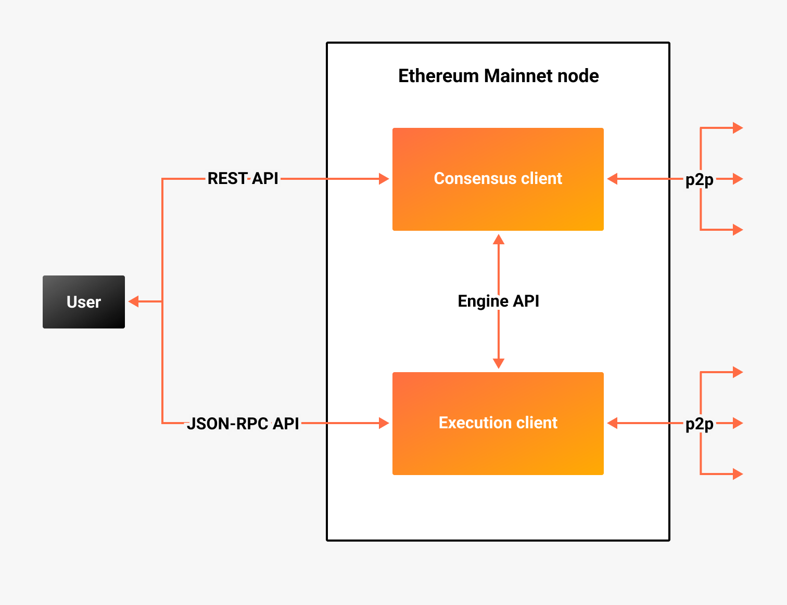

An Ethereum node is an instance of an Ethereum client, which consists of:

- A consensus client (for example, Teku)
- An execution client (for example, Hyperledger Besu)

:::info

Before The Merge, execution clients were known as
[Eth1 clients]((https://blog.ethereum.org/2022/01/24/the-great-eth2-renaming/)), and consensus clients
were called [Eth2 clients](https://blog.ethereum.org/2022/01/24/the-great-eth2-renaming/).

The Merge, completed on **September 15, 2022**, transitioned Ethereum from
proof of work to [proof of stake consensus](proof-of-stake.md).

:::

Execution and consensus clients communicate with each other using the [Engine API](https://besu.hyperledger.org/development/public-networks/how-to/use-engine-api).

### Execution clients

Execution clients, such as [Besu](https://besu.hyperledger.org/), manage the execution layer, including
executing transactions and updating the world state. Execution clients serve
[JSON-RPC API](https://besu.hyperledger.org/development/public-networks/reference/api) requests and
communicate with each other in a peer-to-peer network.

### Consensus clients

Consensus clients, such as Teku, contain beacon node and validator client implementations. The beacon node
is the primary link to the [Beacon Chain](https://ethereum.org/en/upgrades/beacon-chain/) (consensus layer).
The validator client performs [validator duties](proof-of-stake.md) on the consensus layer. Consensus
clients serve [REST API](../reference/rest.md) requests and communicate with each other in a peer-to-peer network.

:::info

To become a validator, you must also run a validator client (either [in the same process as the beacon node](../get-started/start-teku.md#start-the-clients-in-a-single-process) or [separately](../get-started/start-teku.md#run-the-clients-separately)).

:::