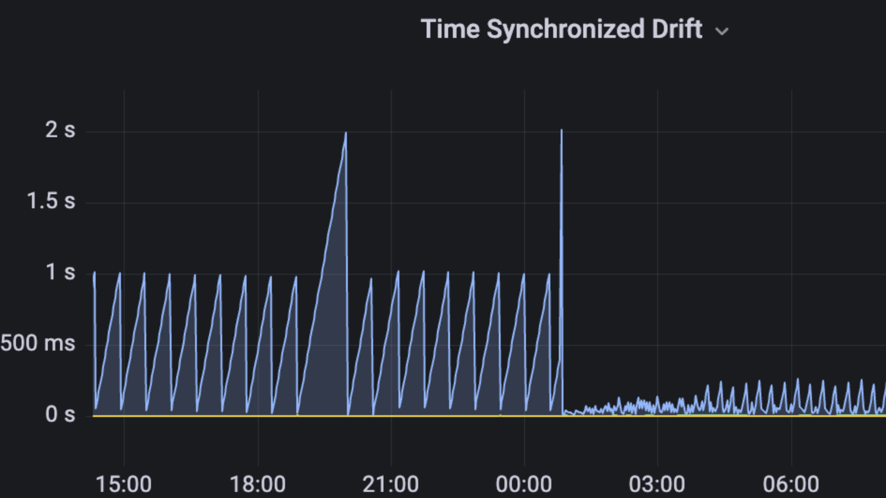

# Network issues

## Speed up sync time

Use [checkpoint sync](../../get-started/checkpoint-start.md) to sync Teku from a recent finalized checkpoint, bypassing
the need to sync from genesis and enabling a quick synchronization process within minutes. To do this, use the
[`--initial-state`](../../reference/cli/index.md#initial-state) CLI option which accepts a URL or file that provides a recent
finalized `BeaconState`. Any synchronized beacon node can provide this from the standard API, and you can view
[the list of public sources](https://eth-clients.github.io/checkpoint-sync-endpoints/).

The [`--initial-state`](../../reference/cli/index.md#initial-state) option is only used when you first create a database. To
restart an existing sync process with checkpoint sync, do the following:

1. Stop the current Teku sync process.
2. Delete the `beacon` directory under your [data path](../../reference/cli/index.md#data-base-path-data-path).
3. Start Teku with the [`--initial-state`](../../reference/cli/index.md#initial-state) option.

Teku will sync within a few minutes, and downloads historic blocks in the background, so it can
help any peers that are syncing from genesis. Teku can run validators and attest while historic blocks are being downloaded.

## Locate the multiaddress and/or ENR of a Teku beacon node

Teku outputs its Ethereum Name Record (ENR) to the logs at startup. You can also access the info via the API:

```bash
curl "http://127.0.0.1:5051/eth/v1/node/identity" | jq
```

You can decode the ENR by using the [ENR Viewer website](https://enr-viewer.com/).

## Resolve peering issues

### Peer connection issues

By default, Teku attempts to get 100 peers. You can increase the number of peers to improve performance, but this does
lead to increased network traffic and a higher number of messages requiring validation.

Teku's attempt to connect with peers is influenced by two CLI options: [`--p2p-peer-lower-bound`](../../reference/cli/index.md#p2p-peer-lower-bound) (default is 64)
and [`--p2p-peer-upper-bound`](../../reference/cli/index.md#p2p-peer-upper-bound) (default is 100).  If you notice a
decline in your beacon node's participation after reducing these parameters, consider increasing them to enhance performance.

### Firewall connection issues

To determine the number of inbound and outbound peers via the beacon node's REST API, you can send a request to the peers
endpoint. This gathers data and organizes it based on the direction, either inbound or outbound.

```bash
curl http://127.0.0.1:5051/eth/v1/node/peers |jq '.data | group_by(.direction)[] | {direction: .[0].direction, count: length}'
```

If only outbound peers are displayed, it indicates that peers cannot connect to your infrastructure from the outside.
Networks typically have a firewall at the entry point (router / modem / gateway) that blocks incoming data by default.

To resolve this, update the firewall to include a rule that allows access to the [`--p2p-port`](../../reference/cli/index.md#p2p-port) (9000 by default)
for both `UDP` and `TCP` traffic. Subsequently, forward this port (TCP and UDP) to the internal IP address of the machine running the
beacon node. Some operating systems also have local firewalls that should be updated to permit communication through this port.

:::info

View the [Prysm guide](https://docs.prylabs.network/docs/prysm-usage/p2p-host-ip/) for more information on this topic, but you need to substitute  your `--p2p-port` (9000 by default) for the port numbers.

:::

### Advertised IP address issues

A possible reason for incoming peers being unable to connect could be an incorrect address specified using the
[`--p2p-advertised-ip`](../../reference/cli/index.md#p2p-advertised-ip-p2p-advertised-ips) option. Teku auto-detects the address to use by
default, so most users won't need to use this option. If you're experiencing issues with incoming peers despite having
correct firewall and forwarding settings, this could potentially be the cause.

### Network gateway issues

A potential reason for incoming peers not being able to connect could be the use of a different port on your network
gateway (router or modem).
This usually happens because only one service can listen on a port. Therefore, if you're running multiple beacon nodes, you'll
need to open multiple ports on your gateway. The simplest solution is to use the same port on your gateway as specified
in your [`--p2p-port`](../../reference/cli/index.md#p2p-port) (9000 by default). However, if necessary, users can also
update the advertised port using the [`--p2p-advertised-port`](../../reference/cli/index.md#p2p-advertised-port) command.

## Resolve poor attestation performance

Troubleshooting poor attestation performance is complicated, and the solution requires you to identify the root cause.

[This video](https://www.symphonious.net/2020/09/08/exploring-eth2-attestation-inclusion/), while slightly dated, still provides valuable and applicable insights.

Common issues include:

- **The CPU is overloaded and Teku is lagging**.
  Monitor CPU stats, and watch the terminal for frequent `regenerating state` messages, common during Teku's struggle.
  In this context, enabling [`--p2p-subscribe-all-subnets`](../../reference/cli/index.md#p2p-subscribe-all-subnets-enabled) can worsen the situation by raising CPU usage.
  A typical problem arises when JVM lacks adequate heap allocation, causing aggressive garbage collection.
  Ensure an environment variable like `JAVA_OPTS=-Xmx8g` is set, with `8g` (five gigabytes of heap) as an optimal value;
  `7g` is acceptable, while anything much lower may lead to problems.

- **Time sync on your server is poor**.
  Ensure `ntpd` or `chrony` is configured correctly.

- **Low numbers of peers, or poor quality peers**.
  Refer to the [peering troubleshooting topic](#resolve-peering-issues) for more information to resolve this.

- **Poor internet speed**.
  An example is someone was on an ADSL link with only about 2.5 Mbps upstream which led to misses, typically anything over 10 Mbps upstream is acceptable.

## Excessive late block import warnings due to time skew

In Ethereum, every proposed block is expected to propagate through the network and reach every beacon node within
four seconds into the current slot. Whenever Teku receives a block after the expected period, it prints a warning to
the logs that looks like:

```bash
2024-03-18 17:32:27.363 WARN  - Late Block Import ***
Block: a0ad54151e1e629ac4a3c23d768e100a9f017b229c927c23ea90111f6399cbdf (8659360)
proposer 858815 arrival 4083ms, gossip_validation +4ms, pre-state_retrieved +3ms,
processed +259ms, execution_payload_result_received +0ms, begin_importing +1ms,
transaction_prepared +0ms, transaction_committed +0ms, completed +13ms
```

The `arrival` value in the message indicates the time the block was received by the node. In this particular
case, the block arrived 4083ms after the start of the slot (more than four seconds). Therefore, Teku printed
the warning message.

Even on a healthy network, some late blocks are expected. It's impossible to completely eliminate them, as most of
the time, a block being late has nothing to do with your node specifically. However, if you're seeing multiple late
block warnings in the logs, it's possible that your server's timing configuration is incorrect, causing your node
to perceive blocks as late when, in reality, the server's clock is misaligned with the rest of the network. This
is why it's important to use a service like NTPD or Chrony to keep your server's clock synchronized.

If you suspect your server clock is out-of-sync, use a dashboard like the
[Grafana Node Exporter Dashboard](https://grafana.com/grafana/dashboards/1860-node-exporter-full/) to check.
Look for the **System Timesync** panel and examine the **Time Synchronized Drift** chart, which shows how much
your server clock is drifting from other nodes in the network. A higher drift indicates a greater deviation between
your system clock and other nodes, potentially causing issues for Teku.

Here is an image that shows the **Time Synchronized Drift** chart before and after the server clock being
adjusted using Chrony:



:::note

Having zero time drift is impossible in practice. The Ethereum protocol has been designed to withstand up to
500ms of variance between nodes.

:::

References:

- [Monitoring a Linux host with Prometheus and node_exporter](https://grafana.com/docs/grafana-cloud/send-data/metrics/metrics-prometheus/prometheus-config-examples/noagent_linuxnode/)
- [Node Exporter Grafana Dashboard](https://grafana.com/grafana/dashboards/1860-node-exporter-full/)
- [Using `chrony` to configure NTP](https://ubuntu.com/blog/ubuntu-bionic-using-chrony-to-configure-ntp)
- [Why clock sync matters in Ethereum 2.0](https://hackmd.io/@ericsson49/BJfLjEX-8)

## Address missing attestations or non-inclusion issues

- No peers might have been present on the attestation subnet.
  Check for a log message when attempting to publish without subscribed peers: `Failed to publish ... for slot ... due to missing peers on the required gossip topic`.
- Several factors could contribute, such as delayed blocks past your inclusion slot causing ripple effects.
  Thus, examining epochs where your attestation was scheduled and checking for late block import warnings would be beneficial.
- Also, consider specific times of day and concurrent network activities.
  It's possible that message transmission could be hindered by factors like bandwidth limitations.

## Invalid signer public key configuration

You may see log error messages similar to:

```bash
Caused by: java.lang.IllegalArgumentException: Expected 48 bytes but received 58.
```

This arises if `validators-external-signer-public-keys` is in the config file without proper quotation for public keys.
In YAML, `0x` prefixed values are treated as numbers, leading the parser to convert them to an unexpected binary format
in Teku. Previous Teku versions had a YAML parser that didn't perform this conversion, making both quoted and unquoted
forms functional.

**Incorrect:**

```yaml
validators-external-signer-public-keys:
  - 0x8f9335f7d6b19469d5c8880df50bf41c01f476411d5b69a8b121255347f1c0b8400ba31a63010b229080240589ad2423
  - 0xb3f3faa8dfa1030714559b95cb0107e53c9ee9c6f2b4b11f29e60417dbc4462052ff2d2dbbe98d808e3093858a3acdcc
  - 0xb2f1e6c00c6716d4cd5cb02b42678ff481e3ae1525cdfc33e4a1711eeb2878da10ebeacdcdc2ef2049410fc60fe5cfe5
  - 0xb7d6cb9ce7397c33b89ec57de0de383c7c294687b8963f92cc60f59bb1de46c56623cd24c9cc1e407db92d1a79920887
  - 0xaf3eab6962987321bdf81e7a10239b91316c643cca64babe81d68e9f9030a6a7b91681168df5a02a9ac3433b8332a712
```

**Correct:**

```yaml
validators-external-signer-public-keys:
  - "0x8f9335f7d6b19469d5c8880df50bf41c01f476411d5b69a8b121255347f1c0b8400ba31a63010b229080240589ad2423"
  - "0xb3f3faa8dfa1030714559b95cb0107e53c9ee9c6f2b4b11f29e60417dbc4462052ff2d2dbbe98d808e3093858a3acdcc"
  - "0xb2f1e6c00c6716d4cd5cb02b42678ff481e3ae1525cdfc33e4a1711eeb2878da10ebeacdcdc2ef2049410fc60fe5cfe5"
  - "0xb7d6cb9ce7397c33b89ec57de0de383c7c294687b8963f92cc60f59bb1de46c56623cd24c9cc1e407db92d1a79920887"
  - "0xaf3eab6962987321bdf81e7a10239b91316c643cca64babe81d68e9f9030a6a7b91681168df5a02a9ac3433b8332a712"
```

## Teku crashes with SIGILL

The BLST library might erroneously use the optimized library version instead of the portable one. This could stem from CPU
auto-detection errors, in which case, obtaining the CPU details from `/proc/cpuinfo` on Linux or `/usr/sbin/sysctl -a` on macOS
will help us to improve it. Alternatively, users might have intentionally set BLST to optimal.

You can specifically request the portable version of BLST (overriding CPU detection) with the following:

```bash
JAVA_OPTS="-Dteku.portableBlst=true"
```

If the user has already set `-Dteku.portableBlst=false` it should be changed to `true`.

## Force Teku to use the optimized BLST library

Check the Teku logs at startup for `Using optimized BLST library` if it was able to detect a compatible CPU, or
`Using portable BLST library` if it could not.

You can force Teku to use the optimized version by setting the environment variable `TEKU_OPTS="-Dteku.portableBlst=false"`.
If you're already setting `TEKU_OPTS` or `JAVA_OPTS`, append `-Dteku.portableBlst=false` to the existing variable. If
you use the optimized library on a CPU that doesn't support it, Teku will crash with a `SIGILL`, in which case you should
switch back to the portable version (`TEKU_OPTS="-Dteku.portableBlst=true"`).

## Configure an archive node

Set [`--data-storage-mode`](../../reference/cli/index.md#data-storage-mode) to `archive`, and provide an
[`--initial-state`](../../reference/cli/index.md#initial-state), you can also use
[`--reconstruct-historic-states`](../../reference/cli/index.md#reconstruct-historic-states) to rebuild
all the old states once blocks have been downloaded.

It will take a while to build up the node, but you'll be able to access all state and block information back to genesis
after it is completed.
