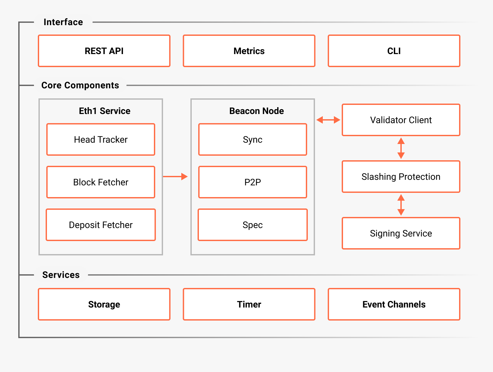

# Teku architecture

The following diagram outlines the Teku high-level architecture.

Teku contains both a beacon node and validator client implementation.
The beacon node is the primary link to the Beacon Chain.
The validator client performs [validator duties](proof-of-stake.md).

You can [run the beacon node only](../get-started/start-teku.md#start-the-beacon-node), or [run the beacon node and validator client](../get-started/start-teku.md#start-the-clients-in-a-single-process).

Read more about the [Ethereum consensus client architecture](https://ethereum.org/en/developers/docs/nodes-and-clients/). For more information about the Teku architecture, contact us on [Teku Discord channel](https://discord.com/invite/consensys).
